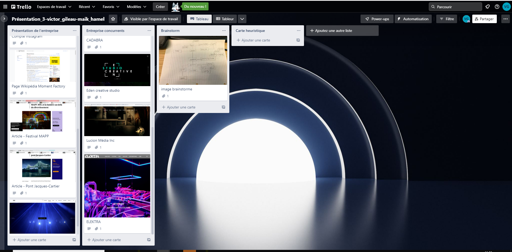

# Cours 12
## Préparation de la présentation 3 
Joindre des images de votre tempête d'idée et des esquisses de votre projet. Expliquer en 2 à 3 lignes votre projet.

Le projet est destiner à la compagnie Moment Factory. Est un projet ayant des projections, des lumières et ce dérolant dans un parcours (point A au point B). Ce déroulant dans un forêt ou un  parcours ce trouvera avec des interactions avec des projections sur les arbres, tout comme les lumières qui donne vie a la forêt, donnant un effet fantastique.

